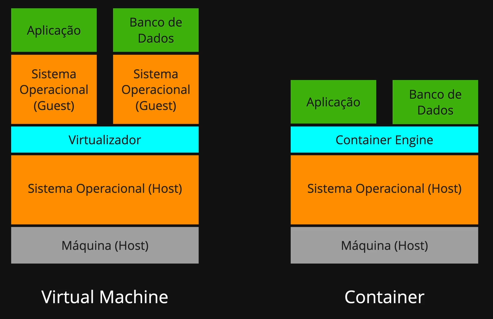

# clone-tabnews

- Versão do NodeJS usada no projeto: v18.20.8 ou LTS/Hydrogen

---

# Anotações

### Características de um Software
- A principal característica que devemos buscar ao construir um Software é que ele seja **altamente modificavel**
- Devemos sempre nos perguntar: _“Quão fácil é modificar este software a curto, médio e longo prazo?”_
- Uma arquitetura simples, aliada a uma modelagem de pastas clara e coerente, é fundamental para facilitar o entendimento e a evolução do código.
- O objetivo é construir um software modular e extensível, como uma espaçonave: capaz de receber novos módulos e funcionalidades conforme necessário — seja para transportar pessoas, cargas ou executar qualquer nova missão.

--- 

### Diferença de **Poc** e **Mvp**

Poc == Prova de Conceito
- é o ato de desenvolver **mini protótipos** que sejam o suficiente para comprovar uma idéia.
- buscar fatos que comprovem que um **conceito** vai ou não funcionar.
- deve ser algo **"barato"** de se fazer, que não se gaste muito _tempo_.
- **exemplo:** tela principal do projeto em html-css ou um figma

Mvp == Mínimo Produto Viável
- é o produto desenvolvido, porém de forma simples.
- Ultra focado em uma "única" solução e altamente nichado.
- Sem ruído.
- Que agrada um público especifico.

Resumo: _encontrar formas baratas para comprovar o que pensamos, depois pular com os dois pés no projeto, criar uma boa fundação para um futuro próspero_

--- 

### Organização de tarefas

- Fazer muito com pouco.
- Planejar muito -> executar pouco.
- Planejar pouco -> executar muito.

- Nivel 1: Se lembrar individualmente, anotar as tarefas em um papel.
- Nivel 2: Ser lembrado em grupo; quador Kanban ou quadro branco.
# clone-tabnews

### Stack:
- Bun @1.3.6
- NextJS

---

# Anotações

### Características de um Software

- A principal característica que devemos buscar ao construir um Software é que ele seja **altamente modificavel**
- Devemos sempre nos perguntar: _“Quão fácil é modificar este software a curto, médio e longo prazo?”_
- Uma arquitetura simples, aliada a uma modelagem de pastas clara e coerente, é fundamental para facilitar o entendimento e a evolução do código.
- O objetivo é construir um software modular e extensível, como uma espaçonave: capaz de receber novos módulos e funcionalidades conforme necessário — seja para transportar pessoas, cargas ou executar qualquer nova missão.

---

### Diferença de **Poc** e **Mvp**

Poc == Prova de Conceito

- é o ato de desenvolver **mini protótipos** que sejam o suficiente para comprovar uma idéia.
- buscar fatos que comprovem que um **conceito** vai ou não funcionar.
- deve ser algo **"barato"** de se fazer, que não se gaste muito _tempo_.
- **exemplo:** tela principal do projeto em html-css ou um figma

Mvp == Mínimo Produto Viável

- é o produto desenvolvido, porém de forma simples.
- Ultra focado em uma "única" solução e altamente nichado.
- Sem ruído.
- Que agrada um público especifico.

Resumo: _encontrar formas baratas para comprovar o que pensamos, depois pular com os dois pés no projeto, criar uma boa fundação para um futuro próspero_

---

### Organização de tarefas

- Fazer muito com pouco.
- Planejar muito -> executar pouco.
- Planejar pouco -> executar muito.

- Nivel 1: Se lembrar individualmente, anotar as tarefas em um papel.
- Nivel 2: Ser lembrado em grupo; quador Kanban ou quadro branco.

---

### Testes

- Unidade => se preocupa em testar a lógica do código. (rápido - fácil)
- Integração => se preocupa em testar a integração entre môdulos/unidades de código (médio)
- E2E => Testes de UI (lento - difícil)

- Sistemas API First <> Integration Tests
  - https://swagger.io/resources/articles/adopting-an-api-first-approach/

---

### DNS

- Como eu servidor que hospeda vários sites sabe qual site retornar em uma reques?
  - Quando a requisição é feita, é passado via headers um contéudo chamado `Host`:
  - O valor que estiver em `Host` vai ser o site redirecionado.

---

### Breaking Change & Non-breaking Change

- Tudo que alterarmos no código que não tem mais compatibilidade com o sistema, isso é uma **Breaking Change**
- Exemplo:
  - `getUser(id) => user='mdelgado'
  - mudar para:
  - `getUser(id) => { "user": "mdelgado", "age": 21 }`

- Agora, adicionar propriedades em uma API ou contratos já existente, é uma **Non-breaking Change**
- Exemplo:
  - `getUser(id) => { "user": "mdelgado", "age": 21 }`
  - mudar para:
  - `getUser(id) => { "user": "mdelgado", "age": 21, "coins" 250 }`

---

### Tipos de versionamentos de API:

- URI Path Versioning
  - https://myapp.com.br/api/v1/contents
  - https://myapp.com.br/api/v2/contents

- Header Versioning
  - Accepts-Version: 1.5
  - Accepts-Version: 2023-09-21

---

### SQL - Linguagem de Consulta Estruturada

- Como resolver o problema das Lambdas da AWS?
  - ps: lambdas nascem e morrem
  - ps: 1 lambda per request
  - ps: uma conexão no banco por request?
  - ps: compartilhar conexão?
  - ps: manter conexão ativa?

### Docker

- Máquina Virtual
- Arquivo de configuração da máquina virtual
- Como subir um SO sem gastar muito armazenamento?
- Uma máquina virtual para cada camada do sistema
  - Banco de Dados
  - Server
  - Front-end
- Namespaces (isolamento de processos)
- CGroups - Control Groups (Limitar memória e armazenamento dos serviços)

- compose.yaml:
  - define os serviços a serem levantados
  - especificando o serviço, especificamos de onde a IMAGEM dos serviços viram -> (docker-file ou docker-hub)
  - dockerfile: codigo fonte que define o ambiente virtual -> compila para binário (imagem) -> rodamos a imagem no container docker